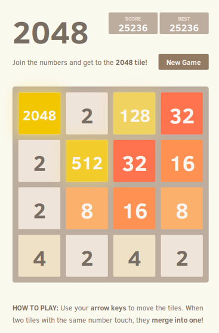

# WebSite_2048_game

> A reproduction of 2048 game in php



## Objective

The objectives were to:
- Initialization of the grid when clicking on New part
- Random draws of the numbers that appear in the grid and their position
- Saving the state of the grid between two player moves
- Algorithm for merging grid boxes
- Management and display of player scor
- A visually nice site

## How

Edit a new index.html file in the local game-2048 directory which will contain the game page.
Using the box below and the content of the other web pages edited so far, add the structure of the page to your index.html file by personalizing it. Put The Game 2048 in the tab title and as the main title of your page. </b>
Display a small paragraph with the rules of the game. Also place the score on the page. At the start of the game, the score is 0. </b>
Open your stylesheet by typing 'geany styles2048.css &' in the local terminal. Improve your web page by adding a little color, justifying the text of the paragraphs, putting the score in bold... </b>
Display a 4*4 box grid below your title and paragraph. Each box will contain the value 0 for now. This value should be centered in the grid box. </b>
Below your first grid, display a new grid using nested div blocks to which you will apply styles as follows:
```
<div class="grid"> ... </div> for the grid
<div class="line"> ... </div> for a line
<div class="cell"> ... </div> for a cell
```
This new grid should have the same appearance as the first: gray boxes with a black border, a red border for the grid and the number centered in the box. Test the display: your two grids should look the same! </b>
Then :

- The index.html file which displays the initial game grid with the score, the New Game button and the 4 direction buttons
  
- The file displays-logs.php which displays the logs stored in logs-2048.txt
  
- The game-2048.php file which includes functions-2048.php and calls the write_log($mesg) function to add a log each time one of the 5 buttons is clicked
  
- The functions-2048.php file which contains at least the write_log($mesg) function
  
- You must also have started thinking about programming the game on the server side
  
- Initialization of the grid when clicking on New part
  
- Random draws of the numbers that appear in the grid and their position
  
- Saving the grid state between two player moves
  
- Algorithm for merging grid boxes
  
- Management and display of player score
  
- Colorization of boxes according to the value contained in each box
  
In your fontions-2048.php file, create a function display_score() which increments the score by 1 if the New Game button is clicked and then displays the score in the HTML page which will be returned to the web browser. Test this function by calling it in the game-2048.php file. </b>
Add a score_to_file() function that copies the value of $score into score.txt.
Add a function file_to_score() which copies the value read in score.txt into $score.
Modify your display_score() function to read the number stored in score.txt before incrementing it, then to write the new value to the same file. You will use the previous two functions.

Check that the score increments several times when you click the New Game button several times.

Add a matrix_to_file() function that copies the values stored in $grid into grid.txt. You will use two nested for loops.
Add a file_to_matrix() function that copies the values stored in grid.txt into $grid.

In grid.txt, should we put a space after the last number of each line? What will the file_to_matrix() function do if this is the case? Modify the matrix_to_file() function accordingly if necessary.

Add a function display_case($i,$j) which echoes the contents of box $i,$j. If the content is 0, you will not display anything.

Test the four functions you just wrote:
In game-2048.php. if the user clicks on New part, the function new_part() must be executed otherwise file_to_matrix() must be executed.
Call the matrix_to_file() function at the end of game-2048.php.
To test the display_case($i,$j) function, modify the HTML code that displays the grid in game-2048.php. You will use two nested for loops in which you will call display_case($i,$j).


## Starting

```bash
# Clone this repo
$ git clone https://github.com/axelvag/WebSite_2048_game.git WebSite_2048_game

# Access
$ cd WebSite_2048_game

# Put it in a php server like Apache or 000WebHost

# TADAMMM ! You have your own 2048 game
```
